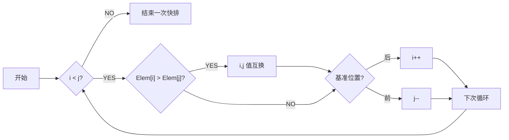

#  数据结构

## 定义

- 数据元素（Data Element）：数据的基本单位
- 数据项（Data Item）：用来描述数据元素，是数据的最小单位
- 数据对象：具有相同性质的数据元素集合
- 数据结构（Data Structure） = 数据对象 + 结构

## 构成

- 逻辑结构
  - 集合
  - 线性结构
  - 树形结构
  - 图形结构（网状结构）


- 物理结构（存储结构）

  - 顺序存储：将逻辑上相邻的元素存储在物理位置上也相邻的存储单元中
  - 链式存储
  - 索引存储
  - 散列存储（哈希存储）

- 数据运算

  运算描述针对逻辑结构，运算实现针对存储结构

# 算法

## 特质

- 有穷性：必须执行有限次运算来实现
- 确定性：对于同意输入只能得到相同输出
- 有效性：含义明确，规定严格
- 输入性：可以有零个或多个输入
- 输出性：可以由一个或多个输出

## 描述

- 自然语言（Natural Language）
- 流程图（FlowChart）

- 类程序设计语言（Similar-programming Language）

## 评估

- 正确性（Correctness）
- 可用性（Usability）
- 可读性（Readability）
- 健壮性（Robustness）
- 效率（Efficiency）：时间代价+空间代价，需要用算法分析（Analytic Method）进行评估
- 可移植性（Mobility）
- 可测试性（Testability）

## 复杂度

### 4.1 时间复杂度

（Time Complexity）

时间开销$$T(n)$$与问题规模$$n$$之间的关系

1. 方法
   1. 频度统计法：确定$$O(f(n))$$
   2. 渐进时间复杂度：知晓级数即可
   
2. 依赖于数据的算法：采用平均复杂度

3. 常见的时间复杂度

   常对幂指阶
   
   $$O(1)<O(\log_2n)<O(n)<O(n\log_2n)<O(n^2)<O(n^3)<O(2^n)<O(n!)<O(n^n)$$

### 空间复杂度

（Space Complexity）

空间开销（内存开销）$$S(n)$$与问题规模$$n$$之间的关系

原地工作：算法所需内存空间为常量，即$$S(n)=O(1)$$

递归调用的空间复杂度=递归调用的深度

# 线性表

## 定义

n 个**相同类型**数据元素的**有限**序列，记为 $$L=(a_1,a_2,\ldots,a_n)$$

L 称为表名，n 称为表长，$$a_i$$：第 i 个称为位序，$$a_1$$ 称为首元素，$$a_n$$ 称为末元素

除首元素，其他元素拥有一个直接前驱；除末元素，其他元素拥有一个直接后继

## 基本操作

1. 初始化 InitList(&L)

2. 求长度 Length(L)

3. 取指定元素的值 GetElem(i, &e)

4. 元素定位 Locate(&e)

5. 修改指定元素的值 SetElem(i, &e)

6. 插入 ListInsert(&L,i,e)

7. 删除 ListDelete(&L,i,&e)

8. 判断是否是空表 Empty(L)

9. 表清空 Clear()

## 顺序表（Sequential List）

顺序表是用顺序存储的方式来实现的线性表

若用静态数组，表长一旦确定便不可更改，建议使用动态数组

- 特点
  1. **随机访问**，在$$O(1)$$时间内找到第i个元素
  2. 存储密度高（=1），每个结点只存储数据元素，不记录相对关系，节省空间
  3. 因为设置了最大容量，空间会有富余，较为浪费
  4. 扩展容量不方便
  5. 插入、删除操作不方便，需要移动大量元素

### 类模板定义

第$$i$$个元素的数组索引为$$i-1$$

```C++
template <class T>
class SeqList
{
protected:
    static const int DEFAULT_SIZE = 100;
    int _length;
    int _maxlen;
    T *_data;

public:
    SeqList(int maxlen = DEFAULT_SIZE);                   //建立空表
    SeqList(T *a, int length, int maxlen = DEFAULT_SIZE); //根据数组创建新表
    SeqList(const SeqList<T> &sa);                        //拷贝构造函数
    virtual ~SeqList();                                   //析构函数
    SeqList<T> &operator=(const SeqList<T> &sa);          //赋值运算符重载

    void ClearList();                 //清空顺序表，暂时不知道有啥用
    int GetLength() const;            //返回长度
    bool IsEmpty() const;             //判空
    bool IsFull() const;              //判满
    void DisplayList() const;         //遍历显示顺序表
    int LocateElem(const T &e) const; //元素定位，返回指定元素位置

    T GetElem(int i) const;             //查找元素，返回查找的元素
    void SetElem(int i, const T &e);    //修改i位置的元素值
    void InsertElem(int i, const T &e); //在i位置插入新元素
    void InsertElem(const T &e);        //在末尾插入新元素
    void DeleteElemByIndex(int i);      //删除i位置的元素
    void DeleteElemByValue(const T &e); //删除指定元素
};
```

### 具体实现

#### 构造函数

```python
template <class T>
SeqList<T>::SeqList(int maxlen) : _length(0), _maxlen(maxlen)
{
    _data = new T[_maxlen]; //申请存储空间
}
```

```python
template <class T>
SeqList<T>::SeqList(T *a, int length, int maxlen) : _length(length), _maxlen(maxlen)
{
    _data = new T[maxlen];
    for (int i = 0; i < length; i++)
        _data[i] = a[i];
}
```

#### 插入元素

```c++
template <class T>
void SeqList<T>::InsertElem(int i, const T &e)
{
    if (IsFull())
    {
        cout << "线性表已满,不可添加新元素!" << endl;
        return;
    }
    if (i < 1 || i > _length)
    {
        cout << "位置不合理！" << endl;
        return;
    }
    else
    {
        for (int j = _length; j >= i; j--) //i后的元素向后移动一格
        {
            _data[j] = _data[j - 1];
        }
        _data[i - 1] = e;
        _length++; //总长+1
    }
}
```

#### 删除元素

```c++
template <class T>
void SeqList<T>::DeleteElemByIndex(int i)
{
    if (IsEmpty())
    {
        cout << "线性表已空,不可删除元素!" << endl;
        return;
    }
    if (i < 1 || i > _length)
    {
        cout << "位置不合理！" << endl;
        return;
    }
    for (int j = i - 1; j < _length - 1; j++)
    {
        _data[j] = _data[j + 1];
    }
    _length--;
}
```

### 复杂度分析

- 在任意位置插入、删除一个数据元素：$$O(n)$$
- 定位、遍历、构造函数、重载赋值：$$O(n)$$
- 其他函数：$$O(1)$$

## 链表

（Linked List）

采用链接存储方式存储的线性表称为线性链表（Linked List），信息域 + 指针域

- 特点
  1. 不要求连续空间，逻辑上相邻的元素，物理上不用相邻
  2. **顺序访问**，下标无助于访存
  3. 插入、删除元素无需大量移动
  4. 易于动态扩展
  5. 存储密度 >1

### 单链表

一个结点由两个域组成，data域存放数据元素，next域存放指向下一结点的指针

一般多用带有头结点的单链表（第一个结点为空）

欲得知已知结点的前结点，需要顺序访问；欲得知已知结点的后结点，仅需使用next指针

#### 结点类模板定义

```c++
template <class ElemType>
struct Node
{
	// 数据成员:
	ElemType data;		  // 数据域
	Node<ElemType> *next; // 指针域

	// 构造函数:
	Node();										   // 无参数的构造函数
	Node(ElemType e, Node<ElemType> *link = NULL); // 已知数数据元素值和指针建立结构
}
```

#### 结点实现

```c++
// 结点类的实现部分
template <class ElemType>
Node<ElemType>::Node()
// 操作结果：构造指针域为空的结点
{
	next = NULL;
}

template <class ElemType>
Node<ElemType>::Node(ElemType e, Node<ElemType> *link)
// 操作结果：构造一个数据域为e和指针域为link的结点
{
	data = e;
	next = link;
}
```

#### 链表类模板定义

```c++
template <class ElemType>
class LinkList
{
protected:
	//  单链表的数据成员
	Node<ElemType> *head; // 头结点指针
	int length;			  // 单链表长度

public:
	//  单链表的函数成员
	LinkList();													 // 无参数的构造函数
	LinkList(ElemType v[], int n);								 // 有参数的构造函数
	virtual ~LinkList();										 // 析构函数
	int GetLength() const;										 // 求单链表长度
	bool IsEmpty() const;										 // 判断单链表是否为空
	void Clear();												 // 将单链表清空
	void Traverse(void (*Visit)(const ElemType &)) const;		 // 遍历单链表
	int LocateElem(const ElemType &e) const;					 // 元素定位
	Status GetElem(int position, ElemType &e) const;			 // 求指定位置的元素
	Status SetElem(int position, const ElemType &e);			 // 设置指定位置的元素值
	Status DeleteElem(int position, ElemType &e);				 // 删除元素
	Status InsertElem(int position, const ElemType &e);			 // 在制定位置插入元素
	Status InsertElem(const ElemType &e);						 // 在表尾插入元素
	LinkList(const LinkList<ElemType> &la);						 // 复制构造函数
	LinkList<ElemType> &operator=(const LinkList<ElemType> &la); // 重载赋值运算
}
```

### 双向循环链表

（Double Circular List）

### 静态链表

（Static List）

用数组方式存储数据，但数据间关系模拟链式存储，适用于不支持指针的语言。

# 栈、队列和递归

栈和队列都是受限的线性表

## 栈

（Stack）

限制存取位置的顺序表，只可在表尾位置插入和删除，所谓后进先出（Last In First Out, LIFO）允许插入删除的一端称为栈顶（top），不允许的一端称为栈底（bottom）。


- 基本操作
  - 初始化
  - 求长度
  - 取栈顶元素
  - 进栈（push，也叫压入）
  - 出栈（pop，也叫弹出）
  - 判断是否为空栈清空栈

### 顺序栈

#### 类模板定义

```c++
template <class T>
class SeqStack
{
protected:
    static const int DEFAULT_SIZE = 100;
    int _top; //_top从0开始
    int _maxlen;
    T *_data;

public:
    SeqStack(int maxlen = DEFAULT_SIZE);           //建立空栈
    SeqStack(const SeqStack<T> &sa);               //拷贝构造函数
    virtual ~SeqStack();                           //析构函数
    SeqStack<T> &operator=(const SeqStack<T> &sa); //赋值运算符重载

    void ClearStack();         //清空顺序表
    int GetLength() const;     //返回长度
    bool IsFull() const;       //判满
    bool IsEmpty() const;      //判空
    void DisplayStack() const; //遍历显示顺序表

    void PushElem(const T &e); //入栈
    T TopElem();               //取栈顶元素
    void PopElem();            //出栈
};
```

#### 具体定义

````c++
template <class T>
void SeqStack<T>::PushElem(const T &e)
//入栈
{
    if (IsFull())
        cout << "顺序栈已满！" << endl;
    else
        _data[++_top] = e;
}

template <class T>
T SeqStack<T>::TopElem()
//取栈顶元素
{
    if (IsEmpty())
    {
        cout << "顺序栈已空，无法取出栈顶元素！" << endl;
        //return NULL;
    }
    else
    {
        return _data[_top];
    }
}

template <class T>
void SeqStack<T>::PopElem()
//出栈
{
    if (IsEmpty())
    {
        cout << "顺序栈已空，无法继续出栈！" << endl;
        return;
    }
    else
    {
        _top--;
    }
}
````

#### 共享存储空间的双顺序栈


### 链式栈

与顺序栈相比，链式栈对于同时使用多个栈的情况下可以共享存储

用不带头结点的的单链表示链式栈，且头指针表示 top，指向栈顶

#### 类模板定义

```c++
template <class T>
class LinkStack
{
protected:
    //不设头结点，_top为第一个节点
    Node<T> *_top;

public:
    LinkStack();
    virtual ~LinkStack();
    LinkStack(const LinkStack<T> &la);
    LinkStack<T> &operator=(const LinkStack<T> &la);

    void ClearStack();
    bool IsEmpty() const;
    int GetLength() const;
    void DisplayStack() const;

    void PushElem(const T &e);
    T TopElem();
    void PopElem();
};
```

#### 具体实现

```c++
template <class T>
void LinkStack<T>::PushElem(const T &e)
//入栈
{
    Node<T> *p = new Node<T>(e, _top);
    if (p == NULL)
        cout << "动态内存耗尽！" << endl;
    else
        _top = p;
}

template <class T>
T LinkStack<T>::TopElem()
//取栈顶元素
{
    if (IsEmpty())
        cout << "链式栈已空" << endl;
    else
        return _top->data;
}

template <class T>
void LinkStack<T>::PopElem()
//出栈
{
    if (IsEmpty())
        cout << "链式栈已空，无法出栈！" << endl;
    else
    {
        Node<T> *p = _top; //取旧栈顶
        _top = _top->next; //_top指向新栈顶
        delete p;          //释放旧栈顶空间
    }
}
```

## 队列

（Queue）

队列允许在表的一端插入元素，在另一端删除元素，所谓先进先出（First In First Out, FIFO）。允许插入的一端称为队尾（rear），允许删除的一端称为队头（front）。

- 操作
  - 初始化
  - 求长度
  - 取队头元素
  - 进队
  - 出队
  - 判空
  - 清空队列

约定：front 指向队头元素，rear 指向队尾元素后一个位置

### 循环队列

为了避免假溢出问题，把顺序队列所使用的存储空间构造成一个逻辑上首尾相连的循环队列，称为循环队列。

- 假溢出问题的解决方法（主要是判空判满的问题）
  - 少用一个存储空间，队满即 `(rear + 1) % maxlen == front`
  - 不设rear，改设length，队空 `length == 0`；队满 `length == maxlen`
  - 新增数据成员flag，队空 `flag == 0`；队满 `flag == maxlen`

#### 顺序队列类模板定义

```c++
template <class T>
class SeqQueue
{
protected:
    static const int DEFAULT_SIZE = 100;
    int _front;
    int _rear;
    int _maxlen; //包含被闲置的那一个存储空间，真实供存储的最大值为_maxlen-1
    T *_data;

public:
    SeqQueue(int maxlen = DEFAULT_SIZE);
    virtual ~SeqQueue();
    SeqQueue(const SeqQueue<T> &q);
    SeqQueue<T> &operator=(const SeqQueue<T> &q);

    int GetLength() const;
    bool IsEmpty() const;
    bool IsFull() const;
    void ClearQueue();
    void DisplayQueue() const;

    void EnterQueue(const T &e); //入队
    T GetFront() const;          //取队头
    void DeleteQueue();          //出队
};
```

#### 具体定义

```c++
template <class T>
int SeqQueue<T>::GetLength() const
//当 rear > front 时，长度为 rear-front;当 rear < front 时，长度为(QueueSize-front)+rear
{
    return (_rear - _front + _maxlen) % _maxlen;
}

template <class T>
bool SeqQueue<T>::IsEmpty() const
{
    return _rear == _front;
}

template <class T>
bool SeqQueue<T>::IsFull() const

{
    return (_rear + 1) % _maxlen == _front;
}

template <class T>
void SeqQueue<T>::ClearQueue()
//清空队列，不需要清空存储的元素
{
    _rear = _front = 0;
}

template <class T>
void SeqQueue<T>::DisplayQueue() const
{
    if (IsEmpty())
        cout << "队列中无元素！" << endl;
    else
    {
        cout << "从对头到队尾，队列元素依次为：";
        for (int i = _front; i != _rear - 1; i = (i + 1) % _maxlen)
        {
            cout << _data[i] << ", ";
        }
        cout << _data[_rear - 1] << endl;
    }
}

template <class T>
void SeqQueue<T>::EnterQueue(const T &e)
//入队
{
    if (IsFull())
        cout << "队列已满，无法继续添加元素！" << endl;
    else
    {
        _data[_rear] = e;
        _rear = (_rear + 1) % _maxlen;
    }
}

template <class T>
void SeqQueue<T>::DeleteQueue()
//出队
{
    if (IsEmpty())
        cout << "队列为空，无法出队！" << endl;
    else
    {
        _front = (_front + 1) % _maxlen;
    }
}
```

### 链式队列

链式队列完全避免了假溢出的问题。

#### 类模板定义

`_front` 是空的头指针，其下一个元素是队头元素；`_rear` 指向队尾元素

初始化时，`_rear` 等于 `_front`

```c++
template <class T>
class LinkQueue
//带头结点
{
protected:
    Node<T> *_front, *_rear;

public:
    LinkQueue();
    virtual ~LinkQueue();
    LinkQueue(const LinkQueue<T> &q);
    LinkQueue<T> &operator=(const LinkQueue<T> &q);

    void ClearQueue();
    int GetLength() const;
    bool IsEmpty() const;
    void DisplayQueue() const;

    void EnterQueue(const T &e);
    T GetFront() const;
    void DeleteQueue();
};
```

#### 具体定义

```c++
template <class T>
void LinkQueue<T>::EnterQueue(const T &e)
{
    Node<T> *p = new Node<T>(e);
    if (p) //判断系统空间是否足够
    {
        _rear->next = p;
        _rear = _rear->next;
    }
    else
    {
        cout << "系统空间不足，无法入队！" << endl;
    }
}

template <class T>
T LinkQueue<T>::GetFront() const
{
    return _front->next->data;
}

template <class T>
void LinkQueue<T>::DeleteQueue()
{
    if (IsEmpty())
    {
        cout << "链队列已空，无法出队！" << endl;
    }
    else
    {
        Node<T> *p = _front->next;
        _front->next = p->next;

        if (_rear == p)
            _rear = _front;
        delete p;
    }
}
```

## 递归

（Recursion）

若一个对象部分地包含自己，或用它自己给自己定义，则此对象是递归的。

若一个过程直接或间接地调用自己，则此过程是递归的过程

对任意一个递归，需要有**出口**和**同一形式**

步骤

- 保留调用信息（返回地址和实参信息）
- 分配调用过程所需的数据空间
- 将控制转到被调用的子过程

特点

- 不节省时间，也不节省空间
- 容易根据定义进行编程
- 结构清晰，便于阅读

### 递归转换为非递归

原因

- 递归的时间效率通常比较差
- 有些计算机语言不支持递归

方法

- 对于尾递归和单项递归，可用循环结构的算法替代。
- 自己用栈来模拟系统运行时的栈（工作记录），保存有关信息。

#### 尾递归和单项递归的消除

尾递归：递归调用语句只有一个，且在函数最后。（如阶乘）

单项递归：所有递归调用彼此间参数无关（不套娃），且均在函数最后。（如斐波那契数列）

#### 用栈模拟系统运行时的栈

# 串、数组和广义表

## 字符串

### 定义

$$
s=“a_0a_1\ldots a_{n-1}”
$$

- 空格符也是字符，空格串不是空串

- 当串采用顺序存储时，存储串的数组名指出了串在内存中的首地址
- C++中存储串的末尾会添加一个结束标识符NULL（编码值为0）

### 模式匹配

（Pattern Matching）

设 ob 为主串，pat 为模式串，查找 pat 在 ob 的匹配位置的操作称为模式匹配

#### Brute-Force算法

从主串首字符开始依次匹配，若匹配失败，从第二个字符位开始匹配，以此类推。它是一种带回溯的算法。

```c++
int BF_find(const string &ob, const string &pat, const int p = 0)
//查找pat在ob中从位置p开始子串
{
    int i = p, j = 0;
    while (i < ob.length() && j < pat.length() && pat.length() - j <= ob.length() - i)
    {
        if (ob[i] == pat[j])//匹配成功，继续匹配下个字符
        {
            i++;
            j++;
        }
        else //匹配失败
        {
            i = i - j + 1; //i退回到上趟匹配的下个字符位置
            j = 0;         //j从头开始
        }
    }
    if (j >= pat.length())
        return i - j;
    else
    {m
        return -1;
    }
}
```

时间复杂度（最坏）：$$O(m\sdot n)$$

#### KMP算法

```c++
int KMP(const string &ob, const string &pat, const int start = 0)
{
    int *next = new int[pat.length()];
    GetNext(pat, next);
    int i = start, j = 0;
    while ((j == -1) || (ob[i] != '\0' && pat[j] != '\0'))
    {
        if (j == -1 || ob[i] == pat[j])
        {
            i++; //继续对下一个字符比较
            j++; //模式串向右滑动
        }
        else
            j = next[j]; //寻找新的匹配字符位置，模式串尽可能向右滑动
    }
    delete[] next;
    if (pat[j] == '\0')
        return (i - j); //匹配成功返回下标
    else
        return -1; //匹配失败返回-1
}
```

```c++
void GetNext(const string &pat, int *next)
//p[k]表示前缀，p[j]表示后缀
{
    int j = 0, k = -1;
    next[0] = -1; //设next[0]的初始值为-1
    while (pat[j] != '\0')
    {
        if (k == -1 || pat[j] == pat[k])
        {
            j++;
            k++;         //j,k向后走
            next[j] = k; //记录到此索引前字符串真子串的长度
        }
        else
            k = next[k]; //寻求新的匹配字符
    }
}
```

## 数组

数组将线性关系进行扩展（一维变多维）

数据类型受限

## 稀疏矩阵

### 矩阵的压缩存储

- 对称矩阵 （$$a_{ij} == a_{ji}$$）：记录三角及对角线
- 三对角矩阵（除主对角线及其相邻两条斜线，其余元素均为0）：行列号插值不为1的为0
- 稀疏矩阵 （大部分元素为0的矩阵）

### 三元组

用（行、列、值）来记录稀疏矩阵中的非零元素

```c++
template <class T>
struct Triple
{
    int _row, _col;
    T _value;

    Triple(){};
    Triple(int row, int col, T value) : _row(row), _col(col), _value(value){};
};
```

### 三元组顺序表

#### 类模板定义

```c++
template <class T>
class TriSparseMatrix
//三元组顺序表实现
{
protected:
    static const int DEFAULT_SIZE = 100;
    Triple<T> *_data;       //存储三元组的数组
    int _maxLen;            //非零元素最大个数
    int _rows, _cols, _num; //行数、列数、非零元素个数
public:
    TriSparseMatrix(int rows = DEFAULT_SIZE, int cols = DEFAULT_SIZE, int maxLen = DEFAULT_SIZE);
    ~TriSparseMatrix();
    TriSparseMatrix(const TriSparseMatrix<T> &copy);
    TriSparseMatrix<T> &operator=(const TriSparseMatrix<T> &copy);
    TriSparseMatrix<T> operator+(const TriSparseMatrix<T> &copy);

    int GetRows() const { return _rows; }
    int GetCols() const { return _cols; }
    int GetNum() const { return _num; }
    void SetElem(int row, int col, const T &v);
    T GetElem(int row, int col);
    void Display();

    void SimpleTranspose(TriSparseMatrix<T> &e); //简单转置
    void FastTranspose(TriSparseMatrix<T> &e);   //快速转置
};
```

#### 具体定义

```c++
template <class T>
void TriSparseMatrix<T>::SetElem(int row, int col, const T &v)
//三种情况：非零变零，零变非零，非零变非零
{
    if (v == 0) //若设置非零值为零
    {
        int i;
        for (i = 0; i < _num; i++) //找到要设零的非零值
        {
            if (_data[i]._row == row && _data[i]._col == col)
            {
                //_data[i] = 0;
                break;
            }
        }
        if (i != _num) //说明确实设置了非零数为零
        {
            for (int j = i; j < _num - 1; j++)
            {
                _data[j] = _data[j + 1];
            }
            _num--; //非零值个数-1
        }
    }
    else
    {
        Triple<T> e(row, col, v);
        int i;
        for (i = 0; i < _num; i++)
        {
            if (_data[i]._row == row && _data[i]._col == col) //修改非零值
            {
                _data[i] = e;
                break;
            }
        }
        if (i == _num) //设置零值为非零值
            _data[_num++] = e;
    }
}

template <class T>
TriSparseMatrix<T> TriSparseMatrix<T>::operator+(const TriSparseMatrix<T> &e)
{
    TriSparseMatrix<T> result(_rows, _cols, DEFAULT_SIZE);
    //result._num = 0;
    if (_rows != e._rows || _cols != e._cols)
    {
        cout << "两矩阵行列数不等，无法进行加法运算！" << endl;
        exit(1);
    }
    int i = 0;                     //控制左值，即this
    int j = 0;                     //控制右值，即e
    T value;                       //存放临时的非零值值
    while (i < _num && j < e._num) //直到一个矩阵的非零元素被遍历完
    {
        if (_data[i]._row == e._data[j]._row) //行号相等时
        {
            if (_data[i]._col == e._data[j]._col) //行列号都相等时
            {
                value = _data[i]._value + e._data[j]._value;
                if (value != 0)
                {
                    result.SetElem(_data[i]._row, _data[i]._col, value);
                }
                i++;
                j++;
            }
            else if (_data[i]._col > e._data[j]._col) //行号相等，左值列号>右值列号
            {
                result.SetElem(e._data[j]._row, e._data[j]._col, e._data[j]._value); //将右值（即列较小值）添加到新矩阵中
                j++;
            }
            else //行号相等，左值列号<右值列号
            {
                result.SetElem(_data[i]._row, _data[i]._col, _data[i]._value); //将左值（即列较小值）添加到新矩阵中
                i++;
            }
        }
        else if (_data[i]._row > e._data[j]._row) //左值行号>右值行号时
        {
            result.SetElem(e._data[j]._row, e._data[j]._col, e._data[j]._value); //将右值（即行较小值）添加到新矩阵中
            j++;
        }
        else //左值行号<右值行号时
        {
            result.SetElem(_data[i]._row, _data[i]._col, _data[i]._value); //将左值（即行较小值）添加到新矩阵中
            i++;
        }
    }
    while (i < _num) //若左值中有剩余元素
    {
        result.SetElem(_data[i]._row, _data[i]._col, _data[i]._value);
        i++;
    }
    while (j < e._num) //若右值中有剩余元素
    {
        result.SetElem(e._data[j]._row, e._data[j]._col, e._data[j]._value);
        j++;
    }
    return result;
}

template <class T>
void TriSparseMatrix<T>::SimpleTranspose(TriSparseMatrix<T> &e)
//简单转置，时间复杂度O(_rows*_cols)
{
    e._rows = _rows;
    e._cols = _cols;
    e._num = 0;
    e._maxLen = _maxLen;
    delete[] e._data;
    e._data = new Triple<T>[_maxLen];
    for (int col = 0; col < _cols; col++) //对整个矩阵的列进行遍历
    {
        for (int i = 0; i < _num; i++) //对_data进行遍历
        {
            if (col == _data[i]._col) //若_data[i]中出现相应列，添加到e中
            {
                e.SetElem(_data[i]._col, _data[i]._row, _data[i]._value);
            }
        }
    }
    //*this = e;
}

template <class T>
void TriSparseMatrix<T>::FastTranspose(TriSparseMatrix<T> &e)
//快速转置，时间复杂度O(_num)
{
    e._rows = _rows;
    e._cols = _cols;
    e._num = _num;
    e._maxLen = _maxLen;
    delete[] e._data;
    e._data = new Triple<T>[_maxLen];

    int *DataNumInCol = new int[_cols]; //存放原矩阵每一列非零个数
    int *FirstDataIne = new int[_cols]; //存放每一列第一个非零元素在e中的索引位置
    for (int i = 0; i < _cols; i++)     //赋初值为0
        DataNumInCol[i] = 0;
    for (int i = 0; i < _num; i++) //记录每列的非零元素个数
        DataNumInCol[_data[i]._col]++;
    FirstDataIne[0] = 0;            //零行第一个非零元素必在0位置
    for (int i = 1; i < _cols; i++) //当前列第一个元素的索引位置=上一列的索引位置+上一列的元素个数
        FirstDataIne[i] = FirstDataIne[i - 1] + DataNumInCol[i - 1];
    for (int i = 0; i < _num; i++)
    {
        int j = FirstDataIne[_data[i]._col]; //j记录当前列的索引
        e._data[j]._row = _data[i]._col;
        e._data[j]._col = _data[i]._row;
        e._data[j]._value = _data[i]._value;
        FirstDataIne[_data[i]._col]++; //当前列的索引值+1
    }
    delete[] DataNumInCol;
    delete[] FirstDataIne;
    //*this = e;
}
```

### 三元组的十字链表

当非零元素经常变动时，不适合用顺序表。

十字链表由行链表和列链表组成（不带头结点的循环表），每个非零元素既处于行链表又处于列链表中

#### 非零元素结点类模板

## 广义表

即列表（List），元素可以是一个数据也可以是一个表
$$
LS=(a_1,a_2,\ldots,a_n)
$$

- 表头：$$a_1$$
- 表尾：$$(a_2,a_3,\ldots,a_n)$$

- 深度：广义表中括号的深度；空表的深度为1

### 广义链表


要点：

1. 带头结点

2. 单元素深度为0，空表深度为一

3. 几乎所有操作都是递归，因为广义表本身的定义即是递归的

4. 求深度公式


#### 结点类模板定义

#### 链表类模板定义

# 数和森林

一个数据可能有多个直接前驱（或后继），需要用非线性数据结构去表示，本章讲解树形结构的定义与实现

## 树

(tree)


### 定义

树$$T$$是一个包含$$n$$个数据元素的有限集合，每个数据元素用一个结点表示，且有

1. $$n=0$$时，$$T$$为空树
2. $$n>0$$时，$$T$$有且只有一个根（root），根结点只有后继，没有前驱
3. $$n>1$$时，根以外的其余结点又是$$m$$个互不受限的非空有限集，它们是根结点的子树（subtree）

### 术语

- 结点（node）：每个数据元素及指向其子树根的分支
- 结点的度（degree of node）：一个结点的分支个数（子树数目）
- 终端结点（terminal tree）：度为 0 的结点，也叫叶子（leaf）
- 非终端结点（nonterminal tree）：度不为 0 的结点，也叫分支结点
- 树的度（degree of tree）：树的结点中最大的度
- 孩子（child）和双亲（parent）：结点 p 的子树称为p的孩子，p 是其子树的双亲
- 兄弟（sibling）：双亲相同的结点
- 祖先（ancestor）：从根结点到结点x所经分支上的所有结点是 x 的祖先
- 子孙（descendant）：以结点 p 为根的所有子树中的所有结点都是 p 的子孙
- 结点的层次（level）：根为第一层，根的孩子第二层，以此类推；树中任意结点的 level 是其双亲结点level+1
- 树的深度（depth）：树中结点的最大层次（根的层次），也叫高度（height）
- 堂兄弟：双亲在同一层的结点
- 有序树：树中结点 p 的子树都是有顺序的
- 无序树：树中结点 p 的子树没有顺序
- 森林（forest）：m 颗互不相交的的树的集合；对树中每个结点而言，其子树的集合即为森林（子树森林）

### 存储结构

采用链式存储为佳，记录前驱和后继其中一个即可完成全部功能

#### 双亲(数组)表示法

1. 采用数组来存储，本质上是静态链表，所以不属于顺序存储

2. Data 域存储结点的数据信息
    Parent 存储结点的双亲在数组中的序号。
3. 实现求双亲操作很方便，但对于求某节点的孩子节点的操作需要查询整个数组，实现求兄弟的操作也比较困难。


#### 孩子表示法

1. 多重链表
    链表中的每个结点包括一个数据域和多个指针域。数据域存储树中结点的自身信息，每个指针指向该结点的一个孩子结点。

    定长，浪费；不定长，难写

2. 数组 + 单链表
    一维数组顺序存储树中各节点的信息，并将各结点的孩子信息组成一个单链表。

#### 双亲 - 孩子表示法
将各结点的孩子结点组成一个单链表，同时用一维数组顺序存储树中的各节点，数组元素包括结点的自身信息、双亲结点在数组中的序号以及该结点的孩子结点链表的头指针。

有些麻烦


#### 孩子 - 兄弟表示法

1. 二重链表表示法
2. 查找某结点的孩子结点比较方便，如果在每一个结点中增加一个指向双亲的指针，就可以方便地找到各结点的祖先。


### 树、森林和二叉树的转换

#### 树转化为二叉树
把树当作有序树看待：约定树中每一个结点的孩子结点按从左到右的次序顺序编号。

- 操作
    1. **连线**：树中所有相邻兄弟结点之间加一条线
    2. **删线**：对树中的每一个结点，只保留它与第一个孩子结点之间的连线，删去它与其他孩子结点之间的连线。
    3. **美化**：以树的根结点为轴心，将这棵树顺时针转动 45 度使其层次分明。

- 性质
    1. 左孩子表示自己的第一个孩子；右孩子表示自己的下一个兄弟
    2. 树作这样的转化所构成的二叉树是唯一的。
    3. 树转化成的二叉树，其根结点无右子树。


#### 森林转化为二叉树

森林转化成的二叉树，其根结点有右子树。

1. 依次将森林中每棵树转化成相应的二叉树。
2. 从第二棵二叉树开始，依次把当前的二叉树作为前一棵二叉树根结点的右子树，此时所得到的二叉树就是由森林转化得到的二叉树。


#### 二叉树转化为森林

1. **连线**：若结点 p 是其双亲结点F的左孩子，则把从结点 p 延沿右分支所找到的所有结点和结点 F 用线连起来。
2. **删线**：删除二叉树中所有结点和其右孩子结点之间的连线。
3. **美化**：整理，使结构层次分明。


### 树的遍历

指按照某种顺序访问树中的每个结点，并使每个结点被访问一次且只被访问一次。

#### 树的先根遍历
若树为空，遍历结束。否则，

1. 访问根结点；
2. 按照从左到右的顺序先根遍历根结点的每一棵子树。

**与二叉树先序遍历结果序列相同。**


ABEFKLCGDHIMNJ

#### 树的后根遍历

若树为空，遍历结束。否则，

1. 按照从左到右的顺序后根遍历根结点的每一棵子树；
2. 访问根结点。

**与二叉树中序遍历结果序列相同。**


EKLFBGCHMNIJDA

#### 树的层次遍历
又称为树的广度遍历。从树的第一层（根结点）开始，自上至下逐层遍历，在同一层中，按从左到右的顺序对结点逐个访问。
借助队列，结构按下述步骤层序遍历树：

1. 初始化队列，并将根结点入队。
2. 当队列非空时，取出队头结点p，转步骤3）；如果队列为空，则结束遍历。
3. 访问取出的结点p；如果结点p有孩子，则依次将它们入队列。
4. 重复步骤2）、3），直到队列为空。

### 森林的遍历

#### 森林的先根遍历
若森林为空，返回；否则，

1. 访问森林中第一棵树的根结点；
2. 先根遍历第一棵树的根结点的子树森林；

3. 先根遍历除第一棵外其他树组成的森林。

**与二叉树先序遍历结果序列相同。**


ABCDEFGHI

#### 森林的中根遍历

若森林为空，返回；否则，

1. 中根遍历第一棵树的根结点的子树森林；
2. 访问森林中第一棵树的根结点；
3. 中根遍历除第一棵外其他树组成的森林。

**与二叉树中序遍历结果序列相同。**


BCDAFEHIG

#### 森林的后根遍历

若森林为空，返回；否则，

1. 后根遍历第一棵树的根结点的子树森林；
2. 后根遍历除第一棵外其他树组成的森林；
3. 访问森林中第一棵树的根结点。

**与二叉树后序遍历结果序列相同。**


DCBFIHGEA

## 二叉树

（Binary Tree）

### 定义

二叉树是特殊的有序树，每个结点的度最多为2

非空时，有根结点BT，余下的结点最多被组成两颗互不相交的、分别被称为BT的左子树（left subtree）和右子树（right subtree）的二叉树


### 性质

1. n 个结点，分支数为 n-1
2. n 个叶子节点，有 n-1 个度为 2 的节点
3. n 个结点，其高度范围为 $$[\lceil log_2(n+1\rceil,n]$$
4. 高度为 h ，其节点数范围为 $$[h,2^h-1]$$
5. 完全二叉树时，找 i 的子节点：$$2i+1 \ 与 \ 2i+2$$

### 遍历

（Traversing Binary Tree, TBT）

定义：按某种顺序访问每个结点，并使每个结点只被访问一次

方法：规定$$L,D,R$$为访问左子树，根，右子树，有：（规定先左再右）

1. $$DLR$$：先序遍历
2. $$LDR$$：中序遍历
3. $$LRD$$：后序遍历

先序+中序（or 后序+中序）的遍历结果可以反向推导出二叉树


#### 先序遍历

```c++
template <class T>
void BinaryTree<T>::PreOrder(BinTreeNode<T> *&root)
{
    if (root != NULL)
    {
        cout << root->_data << " ";
        PreOrder(root->_leftChild);
        PreOrder(root->_rightChild);
    }
}
```

```c++
template <class T>
void BinaryTree<T>::PreOrder_NoRecurve(BinTreeNode<T> *&root)
//DLR 节点不为空时即打印
{
    if (root == NULL)
        return;
    LinkStack<BinTreeNode<T> *> Stack;
    BinTreeNode<T> *p = root;
    while (!Stack.IsEmpty() || p != NULL)
    {
        if (p != NULL)
        {
            cout << p->_data << " "; //先打印父节点
            Stack.PushElem(p);       //父节点入栈
            p = p->_leftChild;       //转到左节点
        }
        else
        {
            if (!Stack.IsEmpty())
            {
                p = Stack.TopElem(); //回溯到父节点
                Stack.PopElem();     //父节点出栈
                p = p->_rightChild;  //转到右节点
            }
            else
                return;
        }
    }
}
```

#### 中序遍历

```c++
template <class T>
void BinaryTree<T>::InOrder(BinTreeNode<T> *&root)
{
    if (root != NULL)
    {
        InOrder(root->_leftChild);
        cout << root->_data << " ";
        InOrder(root->_rightChild);
    }
}
```

```c++
template <class T>
void BinaryTree<T>::InOrder_NoRecurve(BinTreeNode<T> *&root)
//LDR 左节点为空时访问（或 即将转到右节点时访问）
{
    if (root == NULL)
        return;
    LinkStack<BinTreeNode<T> *> Stack;
    BinTreeNode<T> *p = root;
    while (!Stack.IsEmpty() || p != NULL)
    {
        if (p != NULL)
        {
            Stack.PushElem(p); //入栈
            p = p->_leftChild; //转到左节点
        }
        else
        {
            if (!Stack.IsEmpty())
            {
                p = Stack.TopElem();
                Stack.PopElem();         //栈顶出栈
                cout << p->_data << " "; //即将转到右节点时，打印栈顶
                p = p->_rightChild;      //转到右节点
            }
            else
                return;
        }
    }
}
```

#### 后序遍历

```c++
template <class T>
void BinaryTree<T>::PostOrder(BinTreeNode<T> *&root)
{
    if (root != NULL)
    {
        PostOrder(root->_leftChild);
        PostOrder(root->_rightChild);
        cout << root->_data << " ";
    }
}
```

```c++
template <class T>
void BinaryTree<T>::PostOrder_NoRecurve(BinTreeNode<T> *&root)
//LRD 出栈时，需要判定左右节点遍历的完成情况
{
    if (_root == NULL)
        return;
    LinkStack<BinTreeNode<T> *> Stack;
    LinkStack<int> Tag;
    BinTreeNode<T> *p = root;
    //Stack.PushElem(p);
    //Tag.PushElem(0);
    while (!Stack.IsEmpty() || p != NULL)
    {
        if (p != NULL)
        {
            Stack.PushElem(p);
            Tag.PushElem(0);
            p = p->_leftChild;
        }
        else
        {
            while (!Stack.IsEmpty())
            {
                if (Tag.TopElem() == 0) //此时左节点已经遍历完
                {
                    p = Stack.TopElem(); //预出栈
                    Tag.PopElem();
                    Tag.PushElem(1); //将Tag栈顶改为1，表示已经遍历完左节点
                    p = p->_rightChild;
                    break;
                }
                else //此时右节点已经遍历完
                {
                    p = Stack.TopElem();
                    Stack.PopElem(); //真正出栈
                    Tag.PopElem();
                    cout << p->_data << " ";
                }
            }
            if (Stack.IsEmpty())
                return;
        }
    }
}
```

#### 层序遍历

```c++
template <class T>
void BinaryTree<T>::LevelOrder(BinTreeNode<T> *&root)
//层序遍历
{
    LinkQueue<BinTreeNode<T> *> Queue;
    BinTreeNode<T> *p;
    if (root != NULL)
        Queue.EnterQueue(root); //若根非空，则入队
    while (!Queue.IsEmpty())
    {
        p = Queue.GetFront();    //取队头
        Queue.DeleteQueue();     //出队
        cout << p->_data << " "; //打印打印！

        if (p->_leftChild != NULL) //若左节点非空，入队
        {
            Queue.EnterQueue(p->_leftChild);
        }
        if (p->_rightChild != NULL) //若右节点非空，入队
        {
            Queue.EnterQueue(p->_rightChild);
        }
    }
}
```

#### 遍历的用途

1. 打印内容
2. 知晓层数
3. 统计结点
4. 使非线性结构线性化

#### 遍历的 C++ 写法

```c++
void PreOrder(BinTreeNode<T> *root);
void PreOrder(BinTreeNode<T> *root) const;
void PreOrder(const BinTreeNode<T> *root);
void PreOrder(const BinTreeNode<T> *root) const;
void PreOrder(BinTreeNode<T> *&root);
```

### 定义

#### 类模板定义

```c++
template <class T>
class BinaryTree
{
protected:
    BinTreeNode<T> *_root; //二叉树根节点的指针
    T _refValue;           //创建二叉树时的结束标志
    //辅助函数
    /* 创建二叉树 */
    void CreateBinTree_PreOrder(BinTreeNode<T> *&root); //利用已知的二叉树的前序遍历创建二叉树
    /* 遍历二叉树 */
    void PreOrder(BinTreeNode<T> *&root);            //前序遍历
    void InOrder(BinTreeNode<T> *&root);             //中序遍历
    void PostOrder(BinTreeNode<T> *&root);           //后序遍历
    void PreOrder_NoRecurve(BinTreeNode<T> *&root);  //前序遍历非递归
    void InOrder_NoRecurve(BinTreeNode<T> *&root);   //中序遍历非递归
    void PostOrder_NoRecurve(BinTreeNode<T> *&root); //后序遍历非递归
    void LevelOrder(BinTreeNode<T> *&root);          //层次遍历
    /* 获取信息 */
    int GetHeight(const BinTreeNode<T> *root) const;                                //求高度
    int GetNodeNum(const BinTreeNode<T> *root) const;                               //求节点个数
    BinTreeNode<T> *GetParent(BinTreeNode<T> *root, const BinTreeNode<T> *p) const; //求父节点
    int GetmaxWidth(BinTreeNode<T> *root) const;                                    //求最大宽度
    int GetLeafNum(const BinTreeNode<T> *root) const;                               //求叶子节点数目
    /* 其他 */
    BinTreeNode<T> *CopyTree(const BinTreeNode<T> *originNode); //复制二叉树
    void DestroyTree(BinTreeNode<T> *&root);                    //删除二叉树
    bool IsEqual(const BinTreeNode<T> *&a, const BinTreeNode<T> *&b) const;

public:
    /* 构造与析构 */
    BinaryTree() : _root(NULL){};
    BinaryTree(T refValue) : _refValue(refValue) { _root = new BinTreeNode<T>; } //构造函数，指定结束标志refValue
    virtual ~BinaryTree() { DestroyTree(_root); };
    BinaryTree(const BinaryTree<T> &copy);
    /*运算符重载*/
    BinaryTree<T> &operator=(const BinaryTree<T> &copy);
    bool operator==(BinaryTree<T> *s) { return (IsEqual(_root, s->_root)); }
    /* 创建二叉树 */
    void CreateBinTree_PreOrder() { CreateBinTree_PreOrder(_root); } //用先序遍历结果创建二叉树
    /* 遍历二叉树 */
    void PreOrder() { PreOrder(_root); }
    void InOrder() { InOrder(_root); }
    void PostOrder() { PostOrder(_root); }
    void PreOrder_NoRecurve() { PreOrder(_root); }
    void InOrder_NoRecurve() { InOrder(_root); }
    void PostOrder_NoRecurve() { PostOrder(_root); }
    void LevelOrder() { LevelOrder(_root); }
    /* 获取信息 */
    BinTreeNode<T> *GetRoot() const { return _root; }
    int GetHeight() const { return GetHeight(_root); }
    int GetNodeNum() const { return GetNodeNum(_root); }
    int GetmaxWidth() const { return GetmaxWidth(_root); }
    int GetLeafNum() const { return GetLeafNum(_root); }
    BinTreeNode<T> *GetParent(const BinTreeNode<T> *p) const { return (_root == NULL || _root == p) ? NULL : GetParent(_root, p); }
    BinTreeNode<T> *GetLeftChild(const BinTreeNode<T> *p) const { return (p == NULL) ? NULL : p->_leftChild; }
    BinTreeNode<T> *GetRightChild(const BinTreeNode<T> *p) const { return (p == NULL) ? NULL : p->_rightChild; }
    BinTreeNode<T> *GetLeftSibling(const BinTreeNode<T> *p) const;
    BinTreeNode<T> *GetRightSibling(const BinTreeNode<T> *p) const;
    /* 其他 */
    BinTreeNode<T> *CopyTree() { CopyTree(_root); }
    void DestroyTree() { DestroyTree(_root); }
    bool IsEmpty() const { return (_root == NULL) ? true : false; }
    void InsertLeftChild(BinTreeNode<T> *&p, const T &data);
    void InsertRightChild(BinTreeNode<T> *&p, const T &data);
    T GetElem(BinTreeNode<T> *p) const { return p->_data; }
    void SetElem(BinTreeNode<T> *p, T data) { p->_data = data; }
};
```

#### 具体定义

```c++
template <class T>
void BinaryTree<T>::DestroyTree(BinTreeNode<T> *&root)
//销毁二叉树，递归进行。先删左子树再删右子树，最后删自己
{
    if (root != NULL)
    {
        DestroyTree(root->_leftChild);
        DestroyTree(root->_rightChild);
        delete root;
        root = NULL;
    }
}

template <class T>
BinTreeNode<T> *BinaryTree<T>::CopyTree(const BinTreeNode<T> *originNode)
//复制二叉树，返回一个指针，给出一个以originNode为根复制的二叉树的副本
{
    if (originNode == NULL)
    {
        return NULL;
    }
    BinTreeNode<T> *p = new BinTreeNode<T>;
    p->_data = originNode->_data;
    p->_leftChild = CopyTree(originNode->_leftChild);
    p->_rightChild = CopyTree(originNode->_rightChild);
    return p;
}

template <class T>
bool BinaryTree<T>::IsEqual(const BinTreeNode<T> *&a, const BinTreeNode<T> *&b) const
{
    if (a == NULL && b == NULL)
    {
        return true;
    }
    if (a != NULL && b != NULL && a->_data == b->_data && IsEqual(a->_leftChild, b->_leftChild) && IsEqual(a->_rightChild, b->_rightChild))
    {
        return true;
    }
    else
    {
        return false;
    }
}

template <class T>
int BinaryTree<T>::GetNodeNum(const BinTreeNode<T> *root) const
{
    if (root == NULL)
    {
        return 0;
    }
    return 1 + GetNodeNum(root->_leftChild) + GetNodeNum(root->_rightChild);
}

template <class T>
int BinaryTree<T>::GetHeight(const BinTreeNode<T> *root) const
{
    if (root == NULL)
    {
        return 0;
    }
    int i = GetHeight(root->_leftChild);
    int j = GetHeight(root->_rightChild);
    return i > j ? i + 1 : j + 1;
}

template <class T>
BinTreeNode<T> *BinaryTree<T>::GetParent(BinTreeNode<T> *root, const BinTreeNode<T> *p) const
//从root开始搜索p的父节点
{
    if (root == NULL)
    {
        return NULL;
    }
    if (root->_leftChild == p || root->_rightChild == p) //如果找到，返回父节点root
    {
        return root;
    }
    if (GetParent(root->_leftChild, p) == p) //递归在左子树中搜索
    {
        return GetParent(root->_leftChild, p);
    }
    else //递归右子树中搜索
    {
        return GetParent(root->_rightChild, p);
    }
}

template <class T>
BinTreeNode<T> *BinaryTree<T>::GetLeftSibling(const BinTreeNode<T> *p) const
{
    BinTreeNode<T> *r = GetParent(_root, p);
    if (r == NULL)
    {
        return NULL;
    }
    if (r->_rightChild == p)
    {
        return r->_leftChild;
    }
    else
    {
        return NULL;
    }
}

template <class T>
void BinaryTree<T>::InsertLeftChild(BinTreeNode<T> *&p, const T &data)
{
    if (p == NULL)
    {
        return;
    }
    if (p->_leftChild != NULL)
        p->_leftChild->_data = data;
    else
    {
        BinTreeNode<T> *r = new BinTreeNode<T>(data);
        p->_leftChild = r;
    }
}

template <class T>
void BinaryTree<T>::CreateBinTree_PreOrder(BinTreeNode<T> *&root)
//创建二叉树(利用已知的二叉树的前序遍历创建)用#表示空结点
{
    T data;
    cout << "input data: " << endl;
    if (cin >> data)
    {
        if (data != _refValue)
        {
            root = new BinTreeNode<T>(data);
            CreateBinTree_PreOrder(root->_leftChild);  //递归创建左子树
            CreateBinTree_PreOrder(root->_rightChild); //递归创建右子树
        }
        else
        {
            root = NULL;
        }
    }
}

template <class T>
int BinaryTree<T>::GetmaxWidth(BinTreeNode<T> *root) const
//获取二叉树最大宽度，采用层序遍历
{
    LinkQueue<BinTreeNode<T> *> Queue;
    BinTreeNode<T> *p;
    int maxWidth = 0, curWidth = 0, nextWidth; //最大节点数，当前层节点数，下一层节点数
    if (root != NULL)                          //根节点
    {
        maxWidth = 1;
        curWidth = 1;
        Queue.EnterQueue(root); //若根非空，则入队
    }
    while (!Queue.IsEmpty())
    {
        nextWidth = 0; //nextWidth归零
        for (int i = 0; i < curWidth; i++)
        {
            p = Queue.GetFront(); //取队头
            Queue.DeleteQueue();  //出队

            if (p->_leftChild != NULL) //若当前节点有左孩子，nextWidth++
            {
                Queue.EnterQueue(p->_leftChild);
                nextWidth++;
            }
            if (p->_rightChild != NULL) //若当前节点有右孩子，nextWidth++
            {
                Queue.EnterQueue(p->_rightChild);
                nextWidth++;
            }
        }
        curWidth = nextWidth; //此时进入下一层的遍历
        if (curWidth > maxWidth)
            maxWidth = curWidth;
    }
    return maxWidth;
}

template <class T>
int BinaryTree<T>::GetLeafNum(const BinTreeNode<T> *root) const
{
    if (root == NULL)
        return 0;
    else if (root->_leftChild == NULL && root->_rightChild == NULL)
        return 1;
    else
        return GetLeafNum(root->_leftChild) + GetLeafNum(root->_rightChild);
}
```


## 线索二叉树

(Threaded Binary Tree)

利用结点的空链，记录遍历的前驱和后继

规定

- 结点左指针为空，记前驱；结点右指针为空，记后继
- 为了区分指针指的式孩子还是线索关系，加标记，为0记录孩子，为1记录线索
- 添加一个数据域为空的头结点，左指针指向根结点，标记0；右指针记录遍历时第一个访问的结点，标记1

| leftChild    | leftTag | data   | rightTag | rightChild   |
| ------------ | ------- | ------ | -------- | ------------ |
| 左孩子或前驱 | 0或1    | 数据域 | 0或1     | 右孩子或后继 |


### 查找结点的前驱和后继算法

1. 中序线索二叉树

查找p的前驱：查左线索；若无左线索，结点的前驱是遍历左子树时访问的最后一个结点。

查找p的后继：查右线索；若无右线索，结点的后继是遍历右子树时访问的第一个结点。

2. 先序线索二叉树

查找p的前驱：查左线索；若无左线索，结点的前驱是结点的双亲结点，或是先序遍历其双亲结点左子树时最后访问的结点。

查找p的后继：查右线索；若无右线索，结点的后继必为结点的左子树（若存在）或右子树根结点。

3. 后序线索二叉树

查找p的前驱：查左线索；若无左线索，且无右线索时，结点的前驱是右子树根结点；若无左线索，但是有右线索时，结点的前驱是左子树根结点。

查找p的后继，这种查找比较复杂，分4类情况讨论：

​	若p为二叉树的根结点，后继为空；
​	若p为右子树根结点，后继为双亲结点；
​	若p为左子树根结点，且无右兄弟，后继为双亲结点；
​	若p为左子树根结点，且有右兄弟，后继为后序遍历双亲结点右子树时访问的第一个结点。

## 堆

（Heap）

### 定义

在完全二叉树中任何非终端节点的关键字均不大于（或不小于）其左、右孩子结点的关键字

堆的本质是线性关系，但写成完全二叉树形式更为直观


称根节点为堆顶，称堆顶最小为小顶堆（最小堆）；堆顶最大为大顶堆（最大堆）

使用顺序存储来构建堆

#### 向下调整 FilterDown


## 哈夫曼树 

### 术语

- 路径（Path）：从根结点到某个结点经过的分支序列
- （根到结点的）路径长度：路径中的分支数
- 树的路径长度（Path Length，PL）：从根结点到所有叶子结点的路径长度和
- 带权路径长度（WPL）：设一颗有n个带权值叶结点的二叉树，$$W_k$$为第k个叶结点的权值，$$L_k$$为第k个叶结点的路径长度

$$
WPL=\sum\limits_{k=1}^nW_k*L_k
$$

### 定义

对于一组确定权值的结点，所构造出不同形态二叉树的带权路径长度并不相同。将其中具有最小带权路径长度的二叉树称为**哈夫曼树**（最优二叉树）

构造方法：取最小的两个结点构树（左小右大），重复

### 哈夫曼编码

哈夫曼编码是一种前缀码，解码时没有歧义，相比于等长编码可以节省空间

- 计算字母频率作为权值，构造哈夫曼树，
- 叶子结点具有哈夫曼编码
- 规定左子树为 0，右子树为 1，写出字母编码


## 等价类及其表示(并查集)

- 定义

    指能够完成查找、合并功能的集合。

- 操作

    1. `Ufsets(n)`：构造函数，将并查集中 n 个元素初始化为 n 个只有一个单元素的子集合。
    2. `Union(S1,S2)`：把集合 S2 并入集合 S1 中。要求 S1 与 S2 互不相交，否则没有结果。
    3. `Find(d)`：查找单元素 d 所在的集合，并返回该集合的名字。

- 效率问题

    1. 查找效率取决于树的高度
2. 树的高度取决于合并操作


### 合并算法的改进

1. 按照高度

    高度高的作为根节点

    绝对合理，但是高度难以求出

2. 按照树中结点个数

    节点个数多的作为根节点

3. **压缩路径 / 折叠规则**

    也就是直接改进查找算法

    设 j 是以 i 为根的树中的一个结点，则对于从 j 到根 i 的路径上的每一个结点 k，如果 k 的双亲不等于 i，则把 i 设置为 k 的双亲。


​		使用折叠规则完成一次查找，所需时间比 `Find()` 多，但是能改善树的性能，减少以后查找操作所需的时间。

### 类模板定义

结点模板

```c++
template <class T>
class UFSetsNode
{
public:
    T _data;
    int _parent;
};
```

并查集模板

```c++
template <class T>
class UnionFindSets
{
protected:
    UFSetsNode<T> *_sets;
    int _size;
    int SimpleFind(T e) const;
    int CollapsingFind(T e) const;

public:
    UnionFindSets(T *elems, int n);
    ~UnionFindSets();
    T GetElem(int index) const;   //求索引指向的元素
    int GetIndex(T e) const;      //求指定元素的索引
    int Find(T e) const;          //求指定元素所在等价根元素的索引
    void Union(T a, T b);         //合并两个等价类
    void WeightedUnion(T a, T b); //合并两个等价类，结点多者作为结点少者的双亲
    void DepthUnion(T a, T b);    //合并两个等价类，深度大者作为深度小者的双亲
    void Show() const;
};
```

### 具体定义

```c++
template <class T>
int UnionFindSets<T>::Find(T e) const
{
    int index = GetIndex(e);
    if (index != -1)
    {
        while (_sets[index]._parent > -1)
            //不断寻找e的双亲，直到找到根结点
            index = _sets[index]._parent;
        return index;
    }
    else
        return -1;
}

template <class T>
void UnionFindSets<T>::Union(T a, T b)
{
    //此时，根结点的_parent记录的是树的结点数
    int ra = Find(a);
    int rb = Find(b);

    if (ra != -1 && rb != -1 && ra != rb)
    {
        _sets[ra]._parent += _sets[rb]._parent; //个数相加
        _sets[rb]._parent = ra;                 //合并等价类，a作为b的双亲
    }
}

template <class T>
void UnionFindSets<T>::WeightedUnion(T a, T b)
{
    int ra = Find(a);
    int rb = Find(b);
    //此时，根结点的_parent记录的是树的结点数
    if (ra != -1 && rb != -1 && ra != rb)
    {
        if (_sets[ra]._parent <= _sets[rb]._parent)
        {
            _sets[ra]._parent += _sets[rb]._parent;
            _sets[rb]._parent = ra;
        }
        else
        {
            _sets[rb]._parent += _sets[ra]._parent;
            _sets[ra]._parent = rb;
        }
    }
}

template <class T>
void UnionFindSets<T>::DepthUnion(T a, T b)
{
    int ra = Find(a);
    int rb = Find(b);
    //此时，根结点的_parent记录的是树的深度
    if (ra != -1 && rb != -1 && ra != rb)
    {
        if (_sets[ra]._parent == _sets[rb]._parent)
        //若两棵树的深度相同，合并后的最小深度为原深度+1
        {
            _sets[ra]._parent--;
            _sets[rb]._parent = ra; //合并等价类，a作为b的双亲
        }
        else
        //若两棵树的深度不同，合并后的最小深度为较大者
        {
            if (_sets[ra]._parent < _sets[rb]._parent)
                _sets[rb]._parent = ra;
            else
                _sets[ra]._parent = rb;
        }
    }
}
```

# 图

## 基本概念

数据结构中的图：不带自身环，关联边不能多于一条
$$
graph=(V,E)
$$
顶点 vertex

有向边又称为弧，有弧尾（始点）和弧头（终点）

## 存储结构

思考：如何找到环？

### 邻接矩阵

#### 概念


用一维数组 `vertexes[]` 存储顶点信息，二维数组 `arcs[]` 存储边信息


#### 无向图的邻接矩阵


##### 类模板定义

```c++
//图的邻接矩阵类
template <class ElemType, class WeightType>
class AdjMatrixGraph
{
protected:
    int _vexMaxNum, _arcNum;     // 最大顶点数, 边数
    int *_tag;                   // 标志数组
    SeqList<ElemType> _vertexes; // 顶点数组
    int **_arcs;                 // 邻接矩阵, 二维数组
    int _dirType;                // 有向图或无向图
    int _weightType;             // 带权值或不带权值
    WeightType _infinity;

public:
    AdjMatrixGraph(int dirType = 0, int weightType = 0,
                   int vexMaxNum = DEFAULT_SIZE, WeightType infinity = DEFAULT_INFINITY); //默认构造函数
    AdjMatrixGraph(ElemType *es, int vexNum,
                   int dirType = 0, int weightType = 0,
                   int vexMaxNum = DEFAULT_SIZE, WeightType infinity = DEFAULT_INFINITY); //构造函数
    ~AdjMatrixGraph();
    void Clear();
    bool IsEmpty();
    int GetVexNum() const;                          // 求顶点个数
    int GetArcNum() const;                          // 求边数
    int GetOrder(ElemType vex) const;               // 求顶点序号
    ElemType GetElem(int index) const;              // 求指定下标的顶点值
    void SetElem(int index, ElemType vex);          // 更新指定下标的顶点值
    int GetFirstAdjVex(int v) const;                // 求v的第一个邻接点的下标
    int GetNextAdjVex(int v1, int v2) const;        // 求v1相对于v2的下一个邻接点的下标
    void InsertVex(const ElemType &vex);            // 插入顶点
    void InsertArc(int v1, int v2, int weight = 1); // 插入边
    void DeleteVex(const ElemType &vex);            // 删除顶点
    void DeleteArc(int v1, int v2);                 // 删除边
    WeightType GetWeight(int v1, int v2) const;     // 求从顶点为v1到v2的边的权值
    void SetWeight(int v1, int v2, WeightType w);   // 设置从顶点为v1到v2的边的权值
    int GetTag(int v) const;                        // 求顶点v的标志值
    void SetTag(int v, int value);                  // 设置顶点v的标志值
    void Display() const;                           // 打印图
    void SetArcs(int **arcs, int vexNum);           // 设置新的邻接矩阵
    void Dijkstra(int v);                           // 迪杰斯特拉算法
    int GetInDegree(int v) const;                   // 求v的入度
    void TopSort() const;                           // 有向无权图的拓扑排序
    void CriticalPath() const;                      // AOE网络的开始时间、关键路径
    bool IsConnected();                             // 判断图是否连通
    void DFS(int v);                                // 深度优先搜索
    void DFSHelp(int v);                            // 深度优先遍历, 无输出
    void DFSTraverse();                             // 深度优先遍历
    void TearCycle();                               // 破圈法, 求带权连通无向图的最小生成树
};
```

### 邻接表

把邻接矩阵的每一行记为一个单链表，把竖着排列的边连接成为一个边链表

记录有向图的出度，使用**逆邻接表**


### 邻接多重表

(Adjacency Multilist)

用来存储无向图

邻接多重表中，每条边用一个结点表示，每个顶点也用一个结点表示


- data：存储此顶点的数据；
- firstedge：指针域，用于指向同该顶点有直接关联的存储其他顶点的节点


- mark：标志域，用于标记此节点是否被操作过，例如在对图中顶点做遍历操作时，为了防止多次操作同一节点，mark 域为 0 表示还未被遍历；mark 为 1 表示该节点已被遍历；
- ivex 和 jvex：数据域，分别存储图中各边两端的顶点所在数组中的位置下标；
- ilink：指针域，指向下一个存储与 ivex 有直接关联顶点的节点；
- jlink：指针域，指向下一个存储与 jvex 有直接关联顶点的节点；
- info：指针域，用于存储与该顶点有关的其他信息，比如无向网中各边的权


### 十字链表

（Orthogonal List）

用来存储有向图

十字链表（即有向图的邻接多重表）可以看作是邻接表和逆邻接表的合体


## 遍历

思考：深度、广度分别有什么应用？

### 深度优先遍历 DFS

（Depth First Search, DFS）

理论上，结果不唯一

#### 步骤

1. 访问节点 v，并标记其已访问
2. 取 v 的第一个邻接顶点 w
3. 判断
    1. w 是存在
        1. 若是，继续
        2. 若否，返回
    2. w 是否被访问
        1. 若是，取 v 的下下个邻接顶点，转到步骤 3
        2. 若否，访问 w，标记，转到步骤1


#### 时间复杂度

- 邻接表：O(n+e)
- 邻接矩阵：O(n^2^)

#### 实现

### 广度优先遍历 BFS

（Breadth First Search, BFS）

#### 步骤

1. 访问节点 v，并标记其已访问，使 v 入队
2. 队空时，返回；若队非空，继续
3. 出队 v
4. 取 v 的第一个邻接顶点 w
5. 判断 w 是否存在
    1. 若存在，继续
    2. 若不存在，转步骤 3
6. 判断 w 是否被访问
    1. 若被访问，继续
    2. 若未被访问，访问 w 并标记，使 w 入队，继续
7. 取 v 的下下个邻接顶点覆盖 w，转步骤 5


#### 时间复杂度

- 邻接表：O(n+e)
- 邻接矩阵：O(n^2^)

### 连通分量

遍历算法的应用

定义：非连通图中的极大连通子图

## 最小生成树

### 概念

#### 生成树

- 定义：连通图的极小连通子图

- 特点
    - 任意两顶点有且只有一条路径
    - n 个顶点的生成树具有 n-1 条边
    - 生成树不唯一，n 个顶点的完全图有 $$n^{n-2}$$ 种生成树
    - 不同遍历方法 / 不同顶点出发 / 不同存储结构，生成树不同
    - n 个顶点 n-1 条边也不一定是生成树

#### 最小生成树

（minimum cost spanning tree, MST）

- 定义：连通网中，权值总和最小的生成树，全称最小代价生成树


- 性质：假设 N = (V, E) 是一个连通网，U 是顶点集 V的一个非空子集。若 (u, v) 是一条具有最小权值的边，其中u∈U， v∈V - U，则必存在一棵包含边（u，v）的最小生成树

### 克鲁斯卡尔算法

(Kruskal)

#### 步骤


设 G = (V, E) 是具有 n 个顶点的连通网，T = (U，TE) 是其最小生成树。

1. 选取权值最小的边（V~i~，V~j~），若边（V~i~，V~j~）加入到 TE 后形成回路 (环)，则舍弃该边，否则将该边加入到 TE 中。

2. 重复 1，知道 TE 中含有 n-1 条边为止


#### 实现

用最小堆来找最小边

用并查集来判断有无环

### 普利姆算法

(Prim)

基于 MST 性质、

#### 步骤


## 最短路径

（Shortest Path）

### 类别

- 单源点最短路径

    给定网 G 和 V，求 V 到其他顶点的最短路径

- 多源点最短路径

    给定网 G，求其中顶点到其他各顶点的最短路径

### 弧上权值非负的单源点最短路径


#### 迪杰斯特拉算法（Dijkstra）

按路径长度递增的次序来产生最短路径；先求路径最短的一条，然后参照它进行刷新，求出长度次短的一条，以此类推，被求出长度的顶点放入集合 S 中，当 S 满，代表算法结束


引入 dist[]，存储 v 到 v~i~ **当前**找到的最短路径长度；引入 path[]，存储 v~i~ 的直接前驱节点


只看初边

#### 实现

```cpp
template <class ElemType, class WeightType>
void AdjMatrixGraph<ElemType, WeightType>::Dijkstra(int v)
// 求索引为v的顶点的各个最短路径长度
{
    int _vexNum = _vertexes.GetLength();
    WeightType min;
    WeightType dist[_vexNum]; // 存储当前找到的最短路径长度
    int path[_vexNum];        // 存储目标顶点的直接前驱节点

    for (int i = 0; i < _vexNum; i++)
    {
        dist[i] = _arcs[v][i]; // 存入一条边的路径
        SetTag(i, 0);          // 用_tag表示已经找到最短路径的集合
        if (i != v && dist[i] < _infinity)
            // 若dist[i]存在, 添加前驱节点
            path[i] = v;
        else
            path[i] = -1;
    }
    SetTag(v, 1); //自身已经在集合中

    cout << "所选源点: " << GetElem(v) << endl;

    int finalVex; // 已求出最短路径的顶点
    int w;
    for (int i = 1; i < _vexNum; i++)
    // 按递增序列求最短路径
    {
        min = _infinity;
        finalVex = v;
        for (int j = 0; j < _vexNum; j++)
        // 查询最小的最短路径, 找出finalVex
        {
            if (_tag[j] == 0 && dist[j] < min)
            {
                finalVex = j;
                min = dist[j];
            }
        }
        SetTag(finalVex, 1);
        for (int j = GetFirstAdjVex(finalVex); j != -1; j = GetNextAdjVex(finalVex, j))
        // 从上一次找到的最短路径的顶点出发, 依次判断各顶点的最短路径能否更新
        {
            if (_tag[j] == 0 && min + GetWeight(finalVex, j) < dist[j])
            {
                dist[j] = min + GetWeight(finalVex, j);
                path[j] = finalVex;
            }
        }
    }
    // 打印输出
    for (int i = 0; i < _vexNum; i++)
    {
        if (i == v)
            continue;
        string pathStr(1, GetElem(i));

        for (int j = path[i]; j != -1; j = path[j])
        {
            pathStr = string(1, GetElem(j)) + " -> " + pathStr;
        }
        cout << "从顶点 " << GetElem(v) << " 到顶点 " << GetElem(i) << " 的最短路径为: " << pathStr
             << ", 长度为: " << dist[i] << endl;
    }
}
```

### 弧上权值任意值的单源点最短路径

#### 贝尔曼 - 福特算法

从原点依次经过其他顶点，来缩短到达顶点的最短路径长度。要求：途中不能有路径长度为负数的**回路**


递推公式


### 所有点之间的最短路径

#### 重复迪杰斯特拉

以每一个点为原点，重复执行迪杰斯特拉算法；O(n^3^)

#### 弗洛伊德（Floyd）算法


## 活动网络

（Activity Network）

### 用顶点表示活动的网络


#### 概念

- 有向无环图（Directed acycline graph）：一个无环的有向图，简称 DAG 图

- 顶点表示活动的网络（Activity on vertices）：AOV 网络
- 拓扑排序：把 AOV 网络中各顶点按照他们相互之间的优先关系排列成一个线性序列的过程
    - 在有向图中选一个没有前驱的顶点且输出之
    - 从图中删除该顶点和所有以它为尾的弧
    - 重复前两步，直到所有顶点均已输出


### 用边表示活动的网络


#### 概念

- 边表示活动的网络（activity on edges）：简称 **AOE 网络**
    - 边的值：此活动持续的时间


- 顶点表示事件（event），保证一个源点，一个汇点
    - 关键路径：从源点到汇点，具有最大路径长度的路径
    - 关键活动：关键路径上的所有活动


- 求事件（顶点）的最早开始时间 ve：从源点起，入边的值加上其弧尾的最早开始时间，取最大值（看入边，求最大）

- 求事件（顶点）的最晚开始时间 vl：从汇点起，弧头的最早开始时间减去出边的值，取最小值（看出边，求最小）
- 求活动（边）的最早开始时间 ee：弧尾的最早开始时间
- 求活动（边）的最晚开始时间 el：其弧头的最晚开始时间减去活动时间

# 查找

## 基本概念

- 数据表：数据的有限集合
- 关键字：字段、属性域；互不相同的关键字也成为主关键字
- 查找表：支持查找功能的数据表
    - 静态查找表：表中元素固定不变
    - 动态查找表：表中元素在插入和删除时会得到调整，当查找失败时，将给定值的数据元素插入数据表中
- 装载因子 / 装填因子：数据表的长度 m 与数据元素个数 n 的比值，$$\alpha=n/m$$
- 平均查找长度 ASL (Average Search Length)：n 个关键字，第 i 个元素被查找的概率 P~i~，查找第 i 个元素所需进行关键字的比较次数为 C~i~

$$
ASL=\sum_{i=1}^nP_i\times C_i
$$


## 顺序表

### 顺序查找
一个一个去找

#### 一般实现

```C++
template <class T>
int SqSearch(T elem[], int n, T key)
{

    for (int i = 0; i < n && elem[i] != key; i++)
        ;
    if (i < n)
        return i;
    else
        return -1;
}
```

#### 监视哨实现

0 号元素不存内容时，while 中的索引 0 可以起到**监视哨**的作用

```c++
template <class T>
int SqSearch(T elem[], int n, T key)
{
    elem[0] = key;
    int i = n;
    while (elem[i] != key)
        i--;
    return i;
}
```

#### 性能分析

$$
ASL=\sum_{i=1}^n\frac{1}{n}\times i=\frac{n-1}{2}
$$

优点：算法简单，适应面广，对表的结构或关键字是否有序没有要求

缺点：查找效率低

### 二分查找

（Binary Search）

按顺序方式存储 + 关键字排序


#### 迭代实现

#### 递归实现

#### 性能分析

用二叉查找树来分析


$$
ASL=\log_2(n+1)-1
$$
优点：特别当 n 大时，效率高

缺点：只限于顺序存储结构，只适合做静态查找	

### 分块查找

#### 索引顺序表

主表 + 索引表


当完全索引表中的关键字分块有序存放，可以建立二级索引表

块与块之间有序，块内无序


#### 分块查找

分两次查找

### 倒排表

（Inverted Index List）

经常搜索的关键字设次索引

#### 链式倒排表


寻找时，求交集即可

表长不定，管理麻烦

#### 单元素倒排表


### 比较

| 要求     | 顺序查找         | 折半查找 | 分块查找           |
| -------- | ---------------- | -------- | ------------------ |
| ASL      | 最大             | 最小     | 两者之间           |
| 表结构   | 有序表、无序表   | 有序表   | 分块有序表         |
| 存储结构 | 顺序存储、线性表 | 顺序存储 | 顺序存储、线性链表 |

## 二叉排序树

BST（Binary Sort / Search Tree）

对于链式存储，使用二叉排序树（二叉搜索树），以适应动态查找的要求

### 定义

- 要不是空树，要不符合以下性质
    - 左子树节点关键字都小于根节点
    - 右子树节点关键字都大于根节点
    - 左右子树也是二叉排序树

特点：中序遍历结果有序


### 模板定义

```c++
template <class T>
class BinSortTree : public BinaryTree<T>
{
    // 继承二叉树的根节点数据成员
public:
    BinSortTree(T refvalue) : BinaryTree<T>(refvalue){};
    BinSortTree(T *a, int n); // 插入数组元素构建二叉排序树, 不用判断
    ~BinSortTree() {}
    void Insert(const T &x, BinTreeNode<T> *&p); // 以p为根节点, 按大小插入元素
    /*判定是否为二叉排序树*/
    bool IsBST_Recursive(BinTreeNode<T> *r, T *pre, bool *result); // 递归方式判断是否为二叉排序树
    bool IsBST_Recursive();
    void DisplayLarger(BinTreeNode<T> *p, const T &x); // 从大到小输出不小于x的元素
    void DisplayLarger(const T &x)
    {
        DisplayLarger(this->_root, x);
        cout << endl;
    }
    bool Find_NoRecursive(BinTreeNode<T> *&root, const T &x); // 在以root为根的子树中查找x
    bool Find_NoRecursive(const T &x) { return Find_NoRecursive(this->_root, x); }
    void Insert_NoRecursive(BinTreeNode<T> *&root, const T &x); // 在以root为根的子树中插入x
    void Insert_NoRecursive(const T &x) { Insert_NoRecursive(this->_root, x); }
    bool SearchOrInsert(T &x);
};
```

### 查找

- 步骤
    1. 从根开始将 x 与节点值进行比较
    2. 若 x 小，沿着左子树搜索
    3. 若 x 大，沿着右子树搜索
    4. 若与 x 相等，查找成功；若为空则查找失败

比较次数不大于 ` h + 1`

### 性能分析


### 操作

#### 插入

先搜索 BST 中有无该节点，无才插入

查找失败时插入

#### 删除

被删节点为叶子，将双亲结点的相应指针置空

被删节点无右子树，拿左孩子顶替它的位置

被删节点无左子树，拿右孩子顶替它的位置

被删节点左右子树都有

1. 左子树找最大
2. 或者右子树找最小

## 平衡二叉树

AVL

### 定义

- 或是空树，或是符合以下条件的二叉排序树

- 左右子树都是平衡二叉树。
- 左右子树的高度差值不超过 1
- 平衡因子（Balance factor，BF）：左右子树高度差，其绝对值不超过 1
- 其 ASL可保持在 $$O(log_2n)$$


### 平衡旋转

#### LL 平衡旋转——右单旋转

左孩子的左子树失衡

顺时针旋转


#### RR 平衡旋转——左单旋转

右孩子的右子树失衡

逆时针旋转


#### LR 平衡旋转——先左后右双旋转

先逆时针再顺时针

左孩子的右子树失衡


#### RL 平衡旋转——先右后左双旋转

右孩子的左子树失衡


### 插入

#### 思想

1. 按二叉树的排序性质插入节点
2. 若插入后产生失衡，继续步骤 3，否则结束
3. 找到失衡的最小子树
4. 判断平衡旋转类型，进行相应的平衡化处理


#### 示例


### 删除

#### 思想

定义布尔变量 `isShorter` 判断被删除结点的子树高度有没有被缩短


#### 示例

删除结点 50


## B-树

二叉排序树适合在内存中组织较小的索引；若对于存放在外存中的较大的文件系统，使用B-树或B+树做文件索引

### 动态的 m 路查找树

**定义**

- 或是空树，或满足以下条件
- 根节点最多有 m 棵树并具有结构 $$(n,p_0,k_1,p_1,k_2,p_2,\cdots,k_n,p_n)$$。其中，$$p_i$$ 是指向子树的指针，$$k_i$$ 是数据元素的关键字；$$1\le i\le n<m$$
- $$k_i<k_{i+1},i\le i<n$$
- 在  $$p_i$$ 所指的子树中所有数据元素的关键字都大于 $$k_i$$，且小于 $$k_{i+1}$$，$$0\le i\le n$$
- 在  $$p_n$$ 所指的子树中所有数据元素的关键字都大于 $$k_n$$，而子树 $$p_0$$ 中的所有数据元素的关键字均小于 $$k_1$$
- $$p_i$$ 所指的子树也是 m 路查找树，$$0\le i\le n$$


### 定义

一颗 m 阶的 B-树是一种平衡的 m 路查找树，通常用于文件系统（外查找）

失败节点即叶子节点


### 插入

#### 思路

插入指在结点中插入关键字

关键字数在 $$[\lceil m/2 \rceil-1,m-1]$$ 之间

若关键字超出 m-1，结点要分裂


插入是个递归的过程

#### 示例

按照关键字 {35，26，74，60，49，17，41，53，29} 构建 3 阶 B-树


### 删除


### B+树

#### 定义

叶子结点包含了全部关键字及对应指针


## 散列表

基本思想：在存储地址和关键字之间构建一个确定的对应关系。不经过比较就能在一次存取中得到所查元素

### 定义

- 哈希函数：在存储地址和关键字之间构建一个确定的对应关系/函数 $$Addr(ai)=H(ki)$$

- 哈希表/散列表

- 哈希存储/散列存储
- 哈希查找/散列查找
- 冲突 (collision)：$$key1\neq key2,H(key1)=H(key2)$$

### 哈希函数

定义域：全部关键字

值域：0 到 m-1 之间

#### 构造方法

不是重点

- 直接定址法

    $$H(key)=a*key+b$$，无冲突，但是要求散列地址空间大小与关键字集合大小相同

- 数字分析法

- 除留余数法
- 随机数法

### 处理冲突

#### 开放地址法

当冲突发生时，形成一个探查序列，逐个探查，直到找出一个空位置

**探查序列**

1. 线性探测再散列
    - d~i~=1,2,3,...,m-1
2. 二次探测再散列
    - d~i~=1^2^,-1^2^,2^2^,-2^2^,...,k^2^,-k^2^
3. 伪随机探测再散列
    - d~i~=伪随机序列
4. 双散列函数探查法
    - d~i~=iH~2~(key)[计算时间增加]


#### 拉链法

将所有关键字为同义词的记录存储在一个单链表中，并用一维数组存放头指针


### 哈希查找

#### 过程


#### 分析

用 ASL 分析效率

装填因子：$$\alpha=\frac{表中填入的记录数}{哈希表长度}$$


# 排序

原理和算法实现不一定对应


## 基础知识

- 排序（sorting）

- 关键字（key）：分主次关键字

- 排序表

- 排序的稳定性：两个相同值的关键字的相对位置在排序后是否发生变化

- 内部排序：待排的数据在内存上

- 排序的基本操作：比较次数、移动次数

- 趟：对所有数据进行一次操作

### 分组

- 按排序依据原则分组
    - 插入排序
    - 交换排序
    - 选择排序
    - 归并排序
    - 基数排序（分配排序）
- 按排序所需工作量分组
    - 简单的排序方法：$$T(n)=O(n^2)$$
    - 先进的排序方法：$$T(n)=O(log_n)$$
    - 基数排序：$$T(n)=O(d.n)$$

### 排序的存储方式

顺序表、链表、类静态链表

### 各种排序方法的选用

- 时间复杂度
- 空间复杂度
- 稳定性
- 算法结构鲁棒性
- 参加排序数据的规模
    - 较少，采用简单的排序方法
        - 直接插入排序，选择排序
    - 较大，选用执行时间与 $$nlog_2n$$ 成正比的排序方法
        - 快速排序，希尔排序，堆排序，归并排序
    - 较大，且关键字位数少
        - 基数排序
- 关键字的分布情况
    - 分布平均、随机
        - 快速排序（时间短）、堆排序（空间少），希尔排序（也可）
    - 分组基本有序
        - 冒泡排序、直接插入排序

## 交换排序

（Exchange Sort）

对两个数据比较，如果逆序，则两者交换位置

### 冒泡排序

两两相比，重复，每次循环只确定一个最大/小值


#### 实现

顺序表实现

```c++
template <class T>
SeqList<T> BubbleSort(SeqList<T> list)
{
    for (int i = 0; i < list.GetLength - 1; i++)
        for (int j = 0; j < list.GetLength() - 1 - i; j++)
            if (list.GetElem(i) > list.GetElem(i + 1))
                list.ExchangeElem(i, i + 1);
}
```

#### 分析

- 比较次数：$$\sum\limits_{i=1}^{n-1}(n-i)= n(n-1)/2$$
- 移动次数：$$3\sum\limits_{i=1}^{n-1}(n-i)= 3n(n-1)/2$$

- 平均时间复杂度：$$O(n^2)$$
    - 最好情况 $$O(n)$$，最坏情况 $$O(n^2)$$

- 空间复杂度：$$S(n)=O(1)$$
- 稳定

### 快速排序

（quick sort）

任取某个元素作为基准，划分左右子表，再在左右子表中递归快排


#### 实现

一般实现思路

- 选第一个作为基准 i，从最后一个开始比较，记为 j
- 发生逆序，i，j 上的元素互换
- 若一次比较后
    - 基准在前，j --，与后面比；
    - 基准在后，i ++，与前面比
- 对左右子表进行递归



顺序表实现

```cpp
template <class T>
void QuickSortHelp(SeqList<T> &list, int start, int end)
{
    int i = start;             // 基准
    int j = end;               // 从最后开始比较
    bool pivotLocation = true; // true表示基准位置在前
    while (i < j)
    {
        if (list.GetElem(i) > list.GetElem(j))
        {
            list.ExchangeElem(i, j);
            pivotLocation = !pivotLocation;
        }
        if (pivotLocation)
            // 基准位置在前
            j--;
        else
            // 基准位置在后
            i++;
    }
    if (start < i - 1)
        QuickSortHelp(list, start, i - 1);
    if (i + 1 < end)
        QuickSortHelp(list, i + 1, end);
}

template <class T>
void QuickSort(SeqList<T> &list)
{
    QuickSortHelp(list, 0, list.GetLength() - 1);
}
```

#### 分析

- 比较次数：$$\sum\limits_{i=1}^{n-1}(n-i)= n(n-1)/2$$
- 移动次数：$$3\sum\limits_{i=1}^{n-1}(n-i)= 3n(n-1)/2$$
- 平均时间复杂度：$$O(nlog_2n)$$
    - 最好情况 $$O(nlog_2n)$$，最坏情况 $$O(n^2)$$
- 空间复杂度
    - 最坏情况 $$S(n)=O(n)$$
    - 一般情况 $$S(n)=O(log_2n)$$
- 不稳定

## 插入排序

（Insertion Sort）

每次把一个数据插入到已经排序的序列中

### 直接插入排序

（Straight Insertion Sort）


#### 实现

线性表实现

```c++
template <class T>
void StraightInsertionSort(SeqList<T> &list)
{
    int j;
    for (int i = 1; i < list.GetLength(); i++) // 遍历无序区
    {
        T e = list.GetElem(i); // 取出无序区第一个元素
        for (j = i - 1; j >= 0 && list.GetElem(j) > e; j--)
            list.SetElem(j + 1, list.GetElem(j)); // 将比e大的元素后移一位
        list.SetElem(j + 1, e);                   //在j+1处插入e
    }
}
```

#### 分析

- 比较次数：$$\sum\limits_{i=1}^{n-1}i=n(n-1)/2\approx n^2/2$$

- 移动次数：$$\sum\limits_{i=1}^{n-1}i+2=(n+4)(n-1)/2\approx n^2/2$$

- 平均时间复杂度：$$O(n^2)$$
    - 最好情况 $$O(n)$$，最坏情况 $$O(n^2)$$
    - 初始数据表越接近有序，效率越高

- 空间复杂度：$$S(n)=O(1)$$
- 稳定

### 折半插入排序

（Binary Insertion Sort）

相对于直接插入排序，在插入时，折半插入排序不是一个个比，而是利用**折半查找**来寻找位置

只能用于顺序存储

#### 实现

#### 分析

- 比较次数减少了

- 时间复杂度、空间复杂度与直接插入排序相同
- 单纯的折半不能保证稳定性

### 希尔排序

（Shell Sort）又称缩小增量排序

先将待排关键字分为若干子列分别用直接插入法排序，再对全体关键字用直接插入排序

n 个元素，取长度 d < n 作为间隔，分出 d 个子表，所有相距 d 的数据元素放在同一子表中，子表中进行直接插入排序；然后再缩小 d（如取 $$d=\lceil d/2 \rceil$$），重复迭代直到 d = 1 后，将所有数据一起来依一次直接插入排序


#### 分析

- 不稳定

## 选择排序

（Selection Sort）

### 简单选择排序

（Simple selection sort）

在序列中首先找到最小元素放在首位，再在未排序序列（无序区）中寻找最小元素放在已排序序列（有序区）末尾，以此类推


#### 实现

#### 分析

- 相较于冒泡排序，移动次数减少
- 平均时间复杂度：$$O(n^2)$$
    - 最好情况 $$O(n^2)$$，最坏情况 $$O(n^2)$$

- 空间复杂度：$$S(n)=O(1)$$

- 不稳定

### 锦标赛排序

（Tournament sort）又称树形选择排序

将 n 个元素两两分组，分别比较，得到 n/2 个优胜者，保留结果；对优胜者继续比较，以此类推。


#### 分析

- 以空间换时间

- 比较次数：$$O(nlog_2n)$$
- 时间复杂度：$$O(nlog_2n)$$
- 空间复杂度：
- 不稳定

### 堆排序

（Heap sort）

建堆，输出堆顶，调整堆，以此类推


## 归并排序

（Merge sort）

归并：将两个（二路归并）或两个以上的有序表合并成一个新的有序表


### 二路归并排序

一直两两归并，顺序存储时，另外开辟空间


#### 实现

#### 分析

- 以空间换时间

- 时间复杂度：$$O(nlog_2n)$$
- 空间复杂度：$$O(n)$$
- 稳定

### 递归归并

一分为二，左右递归

#### 实现

#### 分析

## 基数排序

（Radix sort）也叫桶排序

本质：多关键字排序

- 最高位优先法（Most significant digit first）MSD
- 最低位优先法（Least significant digit first）LSD

基数：关键字取值的种数


### 链式基数排序

用链表模拟队列


#### 分析

- 时间复杂度 n 记录数，d 关键字位数，radix 关键字取值范围
    - $$O(d(n+radix))$$，即—— n 趟 * （n 次分配 + radix 次收集）

